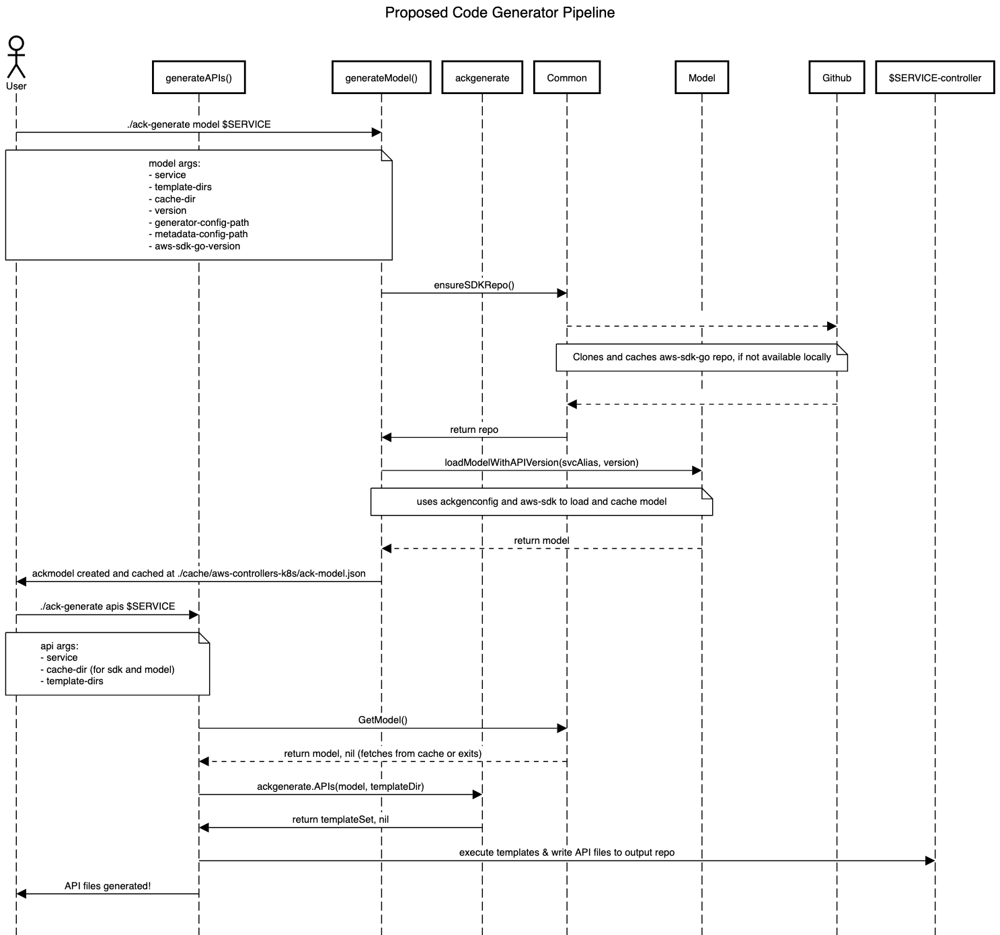

# Adding `model` command

### Key Terms
* `ackgenconfig`: the [code](https://github.com/aws-controllers-k8s/code-generator/blob/main/pkg/generate/config/config.go#L24) representation of *generator.yaml*. an **input** to *code-generator*.
* `resource` | `k8s-resource` | `ackcrd`: the [code](https://github.com/aws-controllers-k8s/code-generator/blob/main/pkg/model/crd.go#L63) reprensenting a single top-level resource in an AWS Service. *code-generator* generates these resources (an **output**) using heuristics and `ackgenconfig`.
* `shape` | `aws-sdk` | `sdk-shape` | `sdk`: the original operations, models, errors, structs for a given AWS service. sourced from *aws-sdk*, ex: [aws-sdk-go s3](https://github.com/aws/aws-sdk-go/blob/main/models/apis/s3/2006-03-01/api-2.json#L1)
* `reconciliation`: logic involving access to or relations between `resource`, `shape`, `ackgenconfig`, and `aws-sdk`
* `ackmodel`: the [code](https://github.com/aws-controllers-k8s/code-generator/blob/main/pkg/model/model.go#L36) representation of ACK's view of the world; the source of truth for `aws-sdk`, `ackgenconfig`, and `reconciliation`

## Problem
`api` and `controller` commands in the code generation `pipeline` require *generator.yaml* and `aws-sdk` to generate the `ackmodel`. Duplicate work being peformed because `ackmodel` is not cached, and this also clutters the logic in both commands with details that shouldn't be relevant to that layer. For example in `controller`, [SetResource](https://github.com/aws-controllers-k8s/code-generator/blob/main/pkg/generate/code/set_resource.go#L74) is responsible for generating Go code; however, it is also checking config for renames, seeing if shapes have changed, etc. making it overloaded with responsibility and more overhead for developers to keep track of.

Additionally, the existing `api` and `controller` commands have a not-so-clear dependency on a folder in the $SERVICE-controller via [getLatestAPIVersion](https://github.com/aws-controllers-k8s/code-generator/blob/26e5da2e7656bb836ee438c05df14f2adc50197d/cmd/ack-generate/command/common.go#L271), which goes against the flow of the `pipeline` and only introduces confusion.


Furthermore, today's `pipeline` makes for a long, opaque feedback loop for platform contributors and $SERVICE-controller maintainers:
  * make changes to *code-generator* (**contributor only**)
  * update *generator.yaml* 
  * `make build-controller`
  * manually check $SERVICE-controller files 
    * As a contributor, it's possible you're familiar enough to know what to look for that was generated
    * As a maintainer, it may look good to go because no syntax errors, but it's not clear if anything is missing
    * and who wants to manually verify `.go` files?


Lastly, the way *generator.yaml* is applied to `aws-sdk` when creating `ackmodel` is inconsistent (and semi-duplicate work). Some overrides such as `custom_shapes` [edit aws-sdk directly](https://github.com/aws-controllers-k8s/code-generator/blob/main/pkg/sdk/custom_shapes.go#L62) while others such as `ignored_operations` [set operation values to nil](https://github.com/aws-controllers-k8s/code-generator/blob/26e5da2e7656bb836ee438c05df14f2adc50197d/pkg/model/model.go#L295) in memory.


## Solution
Add a new command, `model`, which takes in `aws-sdk` and *generator.yaml* as inputs to create and cache `ackmodel`. Existing commands, `api` and `controller`, will remove parameters for `aws-sdk` and *generator.yaml* [TODO: Real param names]() and replace them with `ackmodel` input and/or let it default to `--cache-dir`. The updated `pipeline:`



and updated dev loop:


To address the inconsistent `ackmodel` building, I propose to edit `aws-sdk` directly as much as we can, then introduce more fields to represent other relations that can't be applied by editing `aws-sdk`. Therefore, if we want to rename a field/resource, it would be instead completely removed from model. Conceptually:

```
func (m *Model) RenameShapes() error {
  for shapeName, shape := range m.SDKAPI.API.Shapes {
    if m.cfg.shapeRenamed(shapeName) {
      updateName := m.cfg.GetShapeName(shapeName)
      m.SDKAPI.Shapes[updatedName] = shape
      delete(shapeName, shape)
    }
  }
}
```

Downstream funcs like `SetResource` become easier to use because iterating like so will already have `ackgenconfig` applied:

```
updatedShape := m.GetOutputShape(outputShape)

for memberIndex, memberName := range updatedShape.MemberNames() {
  // updatedShape already has its fields renamed, removed, or added to based
  ...
}

```

### Requirements
* Code generation `pipeline` flows in a single direction
* Optimize `pipeline` by removing repeated work
* Logic to create `ackmodel`, parse `ackgenconfig`, and reconcile differences with `aws-sdk` is centralized and consistent

## Implementation

### Prerequisites
* Analyze and fill any test gaps
* Is the helper/loader exposed by AWS powerful enough to make these edits without being too convoluted? Can push complexity down
* Any issues with marshalling `ackmodel` with updated structs?

### Implementation

#### Create new `model` command
* Add `cmd/ack-generate/model.go`
* Move [loadModelWithLatestAPIVersion](https://github.com/aws-controllers-k8s/code-generator/blob/main/cmd/ack-generate/command/common.go#L219) and deps to use as `generateModel()`
  * remove checking the output directory and instead rely on `--version` to be passed in or default to `v1alpha1`
* Marhsall & cache it


#### Update `api` and `controller` commands
* remove generator and sdk paramaters
* check cache for model; if none, exit and ask to re-run
* update calls in `build-controller` make target and scripts


#### Update `ackmodel` "merge" algorithm
* apply `ackgenconfig` directly to `model.SDKAPI` as much as possible
  * ex: remove setting `nil` for methods and obliterate them from SDKAPI instead
* update downstream callers to use the updated SDKAPI
* :warning: this would be a significant and potentially breaking change since we would be changing current algorithms :warning:


#### In Scope
* add `model` command
* update `pipeline` to use `model` and pass artifacts downstream to `api` and `controller`
* make naming consistent on *touched* code (i.e. `ensureSDKRepo` --> `getSDKRepo`)
* update `ackmodel`-creation algorithm to directly edit `aws-sdk` as much as possible
* tests related to this code
  * for a given `model` expect this generated code/types maybe?

#### Out of Scope
* reconciling 3 different `op` and `op` types being passed around
* field-centric approach


### Test plan
* After relocating logic to `ackmodel`:
  * execute code-generator against X services
  * run the e2e test suite for each service
  * resolve issues
* Save off the marshalled `ackmodel` from above test into `testdata/`
* Update tests to generate `ackmodel`, then compare it to expected blob in `testdata/`


### Alternative Solutions

#### Odd lex, but okay
* write our own [Go interpreter](https://interpreterbook.com/) to take in `aws-sdk-go` and flags/config to generate controller code